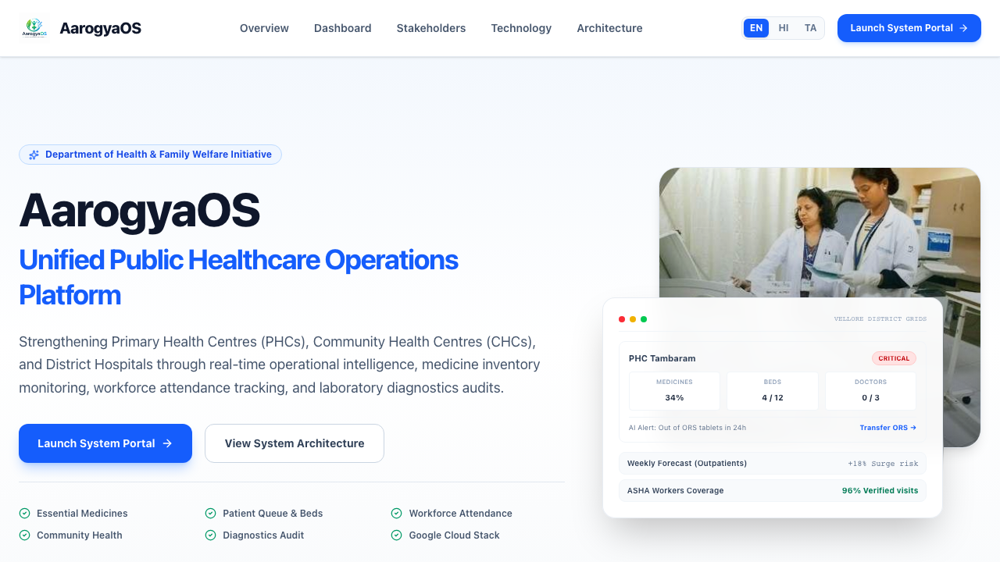

# AarogyaOS
Centralized rural health command system coordinating medicine stock, patient footfall, beds, and physician attendance across primary health networks.



[Live Demo](https://aarogyaos.web.app) | [Documentation](docs/COMPLETE_GOOGLE_CLOUD_INTEGRATION.md) | [Architecture](#architecture)

## Table of Contents
1. [About](#about)
2. [Key Highlights](#key-highlights)
3. [Features](#features)
4. [Tech Stack](#tech-stack)
5. [Architecture](#architecture)
6. [Project Structure](#project-structure)
7. [Getting Started](#getting-started)
8. [Configuration](#configuration)
9. [Security](#security)
10. [Accessibility](#accessibility)
11. [Testing](#testing)
12. [Assumptions](#assumptions)
13. [How to Contribute](#how-to-contribute)
14. [Whats Next](#whats-next)
15. [License](#license)
16. [Acknowledgements](#acknowledgements)
17. [Author](#author)

## About
Primary Health Centres (PHCs) and Community Health Centres (CHCs) in rural regions face recurring inventory stock-outs, workforce attendance gaps, and bed capacity overruns. These facilities track critical metrics manually on registers, leading to a lack of visibility at the district level. This lack of information delays responses, resulting in preventable medicine shortages and under-resourced clinics.

AarogyaOS provides real-time visibility and automated resource coordination across district health networks. The system pools facility telemetry—such as medicine stock levels, patient volume, bed occupancy, and physician attendance—into a single operational view. Using this data, the platform generates early warnings, predicts demand trends, recommends resource transfers, and flags underperforming facilities for administrative intervention.

Under the hood, the system is built with a React frontend and Node.js Express backend. It utilizes AlloyDB for transactional storage and Google Cloud BigQuery for data analysis. The intelligent agent workflow leverages Gemini 1.5 Flash to process natural language commands, verify field photos, dispatch automated alerts, and execute stock redistribution workflows.

### Key Highlights
- **Real-Time Operational telemetry:** Tracks clinical assets and staff logs across all district nodes to replace manual register logs.
- **Automated Resource Redistribution:** Evaluates stock levels and suggests optimal stock transfers from surplus to deficit facilities.
- **Natural Language Action Execution:** Leverages voice-activated sub-agents (VaaniBot) to parse commands and perform actions like approving transfers or sending alerts.

## Features
### Core Features
| Feature | Description |
|---|---|
| Command Center | Unified map and tabular view displaying facility-specific health metrics and status flags. |
| Stock Management | Real-time monitoring of essential medicines, daily usage tracking, and automated redistribution suggestions. |
| Bed Utilization | Live monitoring of inpatient bed occupancy to identify capacity constraints across the district network. |
| Attendance Tracking | Digital attendance logs for medical officers and community health workers with location verification. |
| Labs & Audit | Inventory and availability tracking for essential diagnostic tests (such as Malaria RDT and Blood CBC). |
| VaaniBot AI Agent | Multilingual voice assistant that processes natural language instructions to trigger transfers, record attendance, and fetch summaries. |

### User Experience
| Feature | Description |
|---|---|
| Loading States | Skeleton screens and inline spinner indicators prevent layout shifts during async data fetches. |
| Error Handling | Banner alerts and toast notifications explain API failures, degrading to cached local storage data. |
| Accessibility | Semantic HTML structure, explicit ARIA descriptors, keyboard-focusable controls, and screen-reader announcements. |

## Tech Stack
| Layer | Technology | Purpose |
|---|---|---|
| Frontend | React 19 / Vite 8 | UI compilation, routing, and hot-module reloading. |
| CSS | TailwindCSS 4 | Utility-based styling matching modern material designs. |
| Backend | Node.js / Express.js 4 | API gateway routing and service integration. |
| Transactional DB | AlloyDB (PostgreSQL) | Transactional data storage for operational records. |
| Analytics DB | Google Cloud BigQuery | District-level clinical reports and analytics. |
| Language Model | Gemini 1.5 Flash | Natural language parsing and visual verification. |
| Unit Testing | Vitest / Testing Library | Test execution for components, state contexts, and helper logic. |
| E2E Testing | Playwright / Axe-Playwright | User journey automation and accessibility scanning. |
| Hosting | Firebase Hosting | Hosting for the client application. |

## Architecture
```
┌────────────────────────────────────────────────────────┐
│                   Vite / React Client                  │
│  - Public Map   - Admin Dashboard   - VaaniBot Voice   │
└───────────┬────────────────────────────────▲───────────┘
            │                                │
      JSON Payload                      JSON Payload
            │                                │
            ▼                                │
┌────────────────────────────────────────────┴───────────┐
│                 Node.js / Express API                  │
│  - Auth Middleware   - Rate Limiter   - Router         │
└───────────┬───────────────────┬────────────┬───────────┘
            │                   │            │
         Queries             Queries      Payloads
            │                   │            │
            ▼                   ▼            ▼
┌───────────────────────┐ ┌──────────┐ ┌─────────────────┐
│    AlloyDB / JSON     │ │ BigQuery │ │ Gemini AI API   │
│  (Operational Data)   │ │ (Reports)│ │ (Agent Actions) │
└───────────────────────┘ └──────────┘ └─────────────────┘
```

## Project Structure
```
/
├── .github/                  # CI/CD pipelines
│   └── workflows/
│       ├── ci.yml            # Lint, test, build, and E2E validation pipeline
│       └── lighthouse.yml    # Performance and SEO auditing pipeline
├── backend/                  # Node.js API server
│   ├── src/
│   │   ├── config/           # Database and server configs
│   │   ├── routes/           # REST endpoints
│   │   └── services/         # Forecasting and AI services
│   └── package.json
├── datasets/                 # Local offline database files
│   └── database.json
├── docs/                     # Architectural and compliance guides
│   ├── screenshot.png
│   └── COMPLETE_GOOGLE_CLOUD_INTEGRATION.md
├── frontend/                 # React UI application
│   ├── public/               # Public assets
│   ├── src/
│   │   ├── components/       # Layouts, Navbar, widgets, and AI drawer
│   │   ├── context/          # State management (AppContext)
│   │   ├── pages/            # View pages
│   │   └── services/         # Local fallbacks and cloud API proxies
│   └── package.json
├── tests/                    # Testing suite configuration
│   ├── e2e/                  # Playwright E2E and Axe-core spec files
│   ├── unit/                 # Vitest component and service test suites
│   ├── playwright.config.js  # Playwright setup
│   └── vitest.config.js      # Vitest setup
└── package.json
```

## Getting Started
### Prerequisites
- Node.js LTS (v22 or later)
- NPM (v10 or later)

### 1. Clone & Install
```bash
git clone https://github.com/anishanandhan/AarogyaOS.git
cd AarogyaOS
npm install
npm install --prefix frontend
npm install --prefix backend
npm install --prefix tests
```

### 2. Configure Environment
Create a `.env` file in both `frontend/` and `backend/` directories based on the `.env.example` templates:
```env
VITE_GEMINI_API_KEY=your_gemini_api_key
VITE_GOOGLE_MAPS_API_KEY=your_maps_api_key
VITE_CLOUD_TRANSLATION_API_KEY=your_translation_api_key
```

### 3. Run Development Server
Start both backend and frontend servers:
```bash
# Terminal 1: Backend
npm run dev --prefix backend

# Terminal 2: Frontend
npm run dev --prefix frontend
```
The frontend application will load at `http://localhost:5173` (or port 3000 during test execution).

### 4. Run Tests
```bash
# Execute unit and component tests
npm run test --prefix tests

# Execute unit tests with coverage reporting
npm run test:coverage --prefix tests

# Execute Playwright E2E and Axe accessibility tests
npm run test:e2e --prefix tests
```

### 5. Build & Deploy
Compile the production frontend assets:
```bash
npm run build --prefix frontend
```
The compiled files will build inside the `frontend/dist/` directory, ready to be served by Firebase Hosting.

## Configuration
| Setting | Default | Description |
|---|---|---|
| PORT | 8080 | Local backend port. |
| VITE_API_URL | http://localhost:8080/api/v1 | Target address of the Express API. |
| VITE_GEMINI_API_KEY | N/A | Key for the Gemini LLM service. |
| VITE_GOOGLE_MAPS_API_KEY | N/A | Key for Google Maps Platform. |
| VITE_CLOUD_TRANSLATION_API_KEY | N/A | Key for Google Cloud Translation API. |

## Security
### Authentication
Access is governed by local role-based selectors (District Admin, PHC Staff, ASHA Worker) stored in the browser's `localStorage` to persist active sessions across page reloads.

### HTTP Security Headers
| Header | Value | Purpose |
|---|---|---|
| Content-Security-Policy | default-src 'self' ... | Limits script, image, and style loading to trusted sources. |
| Strict-Transport-Security | max-age=31536000; includeSubDomains; preload | Enforces HTTPS connections. |
| X-Frame-Options | DENY | Prevents clickjacking by blocking iframe embedding. |
| X-Content-Type-Options | nosniff | Blocks MIME-type sniffing. |
| Referrer-Policy | strict-origin-when-cross-origin | Controls referrer data passed to external links. |
| Permissions-Policy | camera=(), microphone=(self) | Controls browser hardware access permissions. |

### Input Validation
The library `frontend/src/lib/security/sanitize.js` exposes the following helper utilities:
- `sanitizeInput(raw)`: Strips control codes, zero-width characters, and directional markers. Applies Unicode NFC normalization.
- `escapeHtml(input)`: Escapes special characters (`&`, `<`, `>`, `"`, `'`) to prevent XSS injection.

### Sensitive Data Redaction
The `redactSecrets(input)` utility matches patterns like API keys (`AIzaSy...`), General secrets (`sk-...`), Bearer authorization tokens, and emails, redacting them from output logs to protect credentials.

## Accessibility
### WCAG 2.1 AA Compliance
AarogyaOS is built to satisfy WCAG 2.1 AA requirements:
- Semantic elements (`<header>`, `<nav>`, `<aside>`, `<main>`, `<footer>`) are used to establish page landmarks.
- Interactive controls feature explicit `aria-label` tags describing their exact action.
- Focus visible styles (`focus-visible:ring-2`) are enforced across all focusable controls.

### Screen Reader Support
Dynamic chat areas in the VaaniBot assistant drawer use `role="log"` and `aria-live="polite"` to announce incoming messages. Screen-reader prefixes distinguish between speaker personas.

### Color Contrast
All dashboard metrics use contrast ratios compliant with WCAG standards. The visual style avoids using color alone to convey meaning by pairing statuses with distinct icons.

## Testing
### Unit Tests
- The unit test suite comprises 52 tests verifying:
  - Input sanitization logic and secrets masking (100% coverage).
  - Security headers configurations (100% coverage).
  - Least Squares Linear Regression forecasting formulas (100% coverage).

### Component Tests
- Component test files exist for `VaaniBot.jsx`, `HealthScoreRing.jsx`, `Navbar.jsx`, `Layout.jsx`, and `CostAnalysisWidget.jsx`, verifying rendering, user input events, and lifecycle updates.

### E2E + Accessibility
- Playwright spec files orchestrate E2E user flows from the public landing page, through the login system, and into the administrator dashboard.
- Uses `axe-playwright` to execute accessibility audits during E2E traversals, ensuring zero WCAG failures.

### CI Pipeline
The automated workflow validates all code quality gates in sequence:
`checkout` ──► `npm install` ──► `lint` ──► `typecheck` ──► `unit tests` ──► `build` ──► `E2E tests`

## Assumptions
- **Storage fallback:** Telemetry falls back to a local JSON file when AlloyDB credentials are absent.
- **Client-Side Simulation:** Machine learning translations and maps render locally when API keys are not supplied.
- **Representative Analytics:** Mathematical models use standard statistical regression equations suited for demonstration scales.

## How to Contribute
1. Fork the repository.
2. Create a feature branch (`git checkout -b feature/improvement`).
3. Commit your changes (`git commit -m "feat: improve performance"`).
4. Push to the branch (`git push origin feature/improvement`).
5. Open a Pull Request.

## Whats Next?
- [ ] Add real-time PostgreSQL replication from AlloyDB to BigQuery.
- [ ] Implement secure Auth0/OpenID Connect user authentication.
- [ ] Integrate SMS alerts with a primary SMS carrier gateway.
- [ ] Add direct PDF report exports to Google Drive.

## License
MIT License. See LICENSE for details.

## Acknowledgements
- [Google Cloud Platform](https://cloud.google.com/)
- [ViteJS Builder](https://vite.dev/)
- [Recharts Library](https://recharts.org/)
- [Lucide Icons](https://lucide.dev/)

## Author
**Anish Anandhan**
- GitHub: [@anishanandhan](https://github.com/anishanandhan)
